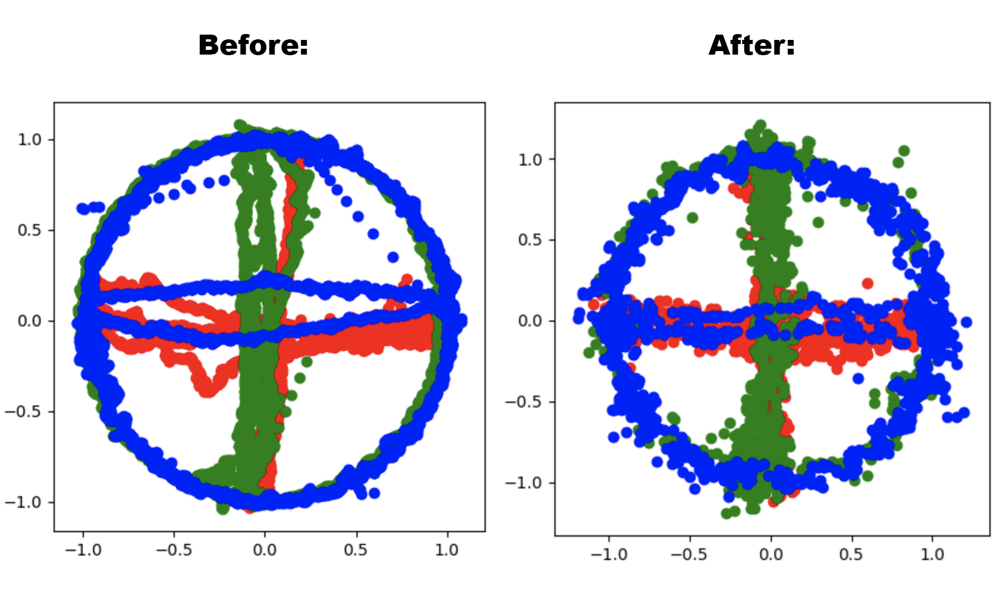

# SimplestIMUCalibration
The simple calibration process of the MEMS IMU suite.

## Introduction

The main errors of the MEMS IMU are the zero offset and the error of the scale factor.

Zero-offset is a non-zero sensor measurement at the moment when the input signal is zero. Note that the noise level in rough micromechanical gyroscopes can completely hide the measurement of the angular velocity of the Earth's rotation. The latter means that the gyro shows non-zero angular velocity measurements (up to values exceeding 20 degrees/s), even when the sensor is at rest.
 The zero offset error can be decomposed into the sum of systematic and random (hello to Allan Variance) components.
 The systematic zero offset is estimated using a calibration procedure and excluded from the sensor readings during operation.

The offset value depends on the batch of the sensor, on the sensor itself, and also on whether it was subjected to strong (~1000g) accelerations and high temperatures (when soldering - up to 300-400 degrees).
 In addition, this value may change by reconnecting the power.

## Calibration procedure

The program reads the data stream from the serial port and visualizes the measurements and the zero-offset calibration calculation.
Next, we will subtract these values for each data sample of sensor data.

The calibration process using Python is described in the following interactive [Jupyter notebook](Mag_Gyro_Acc_Calibration.ipynb).

### Accelerometer
For accelerometer calibration, slowly rotate the module multiple times in all axis directions. Be sure to rotate the sensor slowly.

https://user-images.githubusercontent.com/21182465/201548314-fe4ac1df-9672-46b9-b53e-8b3ff8a4fa5c.mov

##### Results:

### Accelerometer calibration using Sphere approach
##### Results

### Magnetometer
For the magnetometer calibration, wave the module in figure eight until done, and make sure it is not near any strong magnets.

https://user-images.githubusercontent.com/21182465/201548333-0c531864-4acd-444d-909f-66b76d2269a9.mov

Noisy measurements of the three-axis magnetometer:

### Gyroscope

For Gyro calibration, just put down the module and do not touch or move it.

##### Results:

